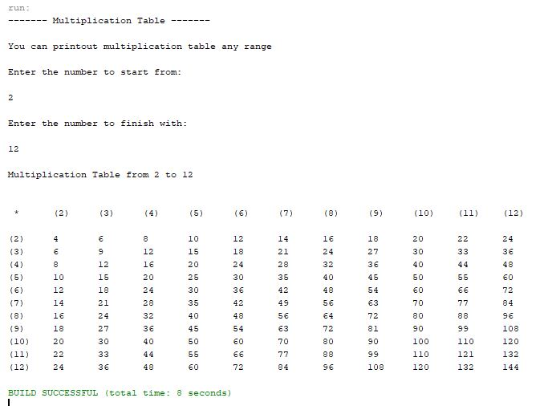

# Java basics
_Multiplication Table_

This project is for Java learning and practicing only. 
During this project main aim to print out multiplication table of any given range.

 
This is a small program, which takes user input of two intergers. 
First interger defines starting position from which number to start generate the table.
Second interger defines the end position.

## Project goals

-   User input
-   Table format

## Authors

[Vadim](https://github.com/vadimmozeiko)
